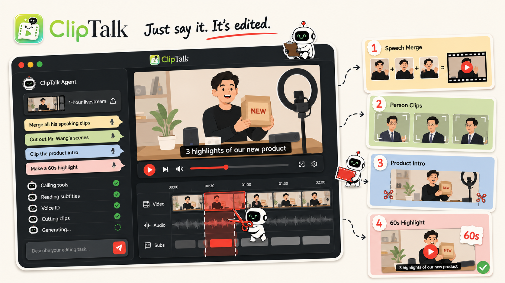

<div align="center">

<!-- 👇 在这里替换成你的封面 Banner 图（就用我们之前设计的那张海报） -->


# ClipTalk ✂️

### An AI Agent That Edits Videos Through Conversation

**Just say it. It's edited.**

[](./LICENSE)
[](https://github.com/yourorg/ClipTalk)
[](https://github.com/yourorg/ClipTalk/releases)
[](https://discord.gg/yourlink)

**English** · [简体中文](./README_zh.md) · [Live Demo](#) · [Documentation](#)

</div>

---

## 🎥 See It In Action

<!-- 👇 在这里放核心演示 GIF：用户输入一句话 → Agent 执行 → 成片输出 -->
<div align="center">
  
</div>

<br/>

> Upload a 1-hour livestream, then just type: *"Merge all his speaking
> clips"*, *"Cut out Mr. Wang's scenes"*, *"Clip the product intro"*, or
> *"Make a 60s highlight"* — ClipTalk understands your footage, plans the
> edit, calls the right tools, and delivers the finished clips.

---

## 📰 News

- **[2026-XX-XX]** 🎉 ClipTalk is now open-source!
- **[2026-XX-XX]** 🚀 Released Voice ID — target any speaker by name across hours of footage.
- **[2026-XX-XX]** ✨ Added one-command highlight generation for livestreams.

<!-- 后续更新持续追加到这里 -->

---

## 🌟 Showcase — One Sentence, One Edit

> Real editing tasks completed by ClipTalk with a single instruction.
> <!-- 在这里放不同场景的剪辑案例，建议用 GIF 对比：原始素材 → 指令 → 成片 -->

<table>
  <tr>
    <td align="center"><b>📺 Livestream Highlights</b><br/></td>
    <td align="center"><b>🎤 Interview Cuts</b><br/></td>
    <td align="center"><b>📦 Product Demos</b><br/></td>
  </tr>
  <tr>
    <td align="center"><b>🏢 Meeting Recordings</b><br/></td>
    <td align="center"><b>🎓 Course Lectures</b><br/></td>
    <td align="center"><b>➕ More coming</b><br/></td>
  </tr>
</table>

---

## 💡 What is ClipTalk?

ClipTalk is an **AI video-editing agent**. You don't drag clips on a
timeline or scrub through hours of footage — you just describe what you
want in natural language, and the agent handles the entire process:
**understanding the footage → locating the target content → planning the
edit → executing cuts → delivering the final clips.**

It's not a keyword search over subtitles. ClipTalk actually **understands
who is on screen, who is speaking, and what they are talking about** —
combining speech recognition, voiceprint identification, face detection,
and topic segmentation — so instructions like *"cut out Mr. Wang's
scenes"* just work, even in a multi-speaker 1-hour recording.

---

## ✨ Core Features

### 1. 💬 Conversational Editing
Describe the task, get the result. No timeline skills required —
*"merge all his speaking clips"* is a complete editing workflow in one
sentence. Follow up with refinements: *"make it shorter"*, *"start from
the part about pricing"*.

### 2. 🧠 Content-Aware Footage Understanding
ClipTalk builds a structured understanding of your video before editing:
- **Speech transcription** — full subtitles with timestamps
- **Voiceprint ID** — knows *who* is speaking, not just *that* someone is
- **Face detection & tracking** — locates every person's on-screen segments
- **Topic segmentation** — finds where the product intro starts and ends

### 3. 🎯 Person-Targeted Clipping
Name a person, get their clips. *"Cut out Mr. Wang's scenes"* combines
face and voice identification to extract every segment where the target
person appears or speaks — across the entire footage.

### 4. 🗣️ Speech Merge
Automatically detect and merge all segments where a specific speaker is
talking, removing silence, filler, and other speakers' turns — turning
scattered moments into one continuous clip.

### 5. ⚡ One-Command Highlights
*"Make a 60s highlight"* — the agent scores the footage for energy,
key statements, and audience reactions, then assembles a tight highlight
reel with subtitles, ready to publish.

### 6. 🤖 Agent-Orchestrated Multi-Step Edits
Behind every instruction, the agent **plans and executes a tool
pipeline** — reading subtitles, running voice ID, locating segments,
cutting clips — and shows you its working log in real time, step by step,
with nothing hidden.

### 7. 🎞️ Editable Timeline Output
Results don't disappear into a black box. Every edit lands on a
**multi-track timeline** (video / audio / subtitles) where you can
inspect the cuts, nudge boundaries, and re-render — AI does the heavy
lifting, you keep the final say.

### 8. 🔄 Iterative Refinement
Not happy with a result? Just keep talking. Each instruction builds on
the previous state — *"remove the second clip"*, *"add subtitles"*,
*"export vertical for mobile"* — no need to start over.

### 9. 📚 Built for Long Footage
Designed for the hard cases: 1-hour livestreams, multi-speaker panels,
full-day event recordings. The longer and messier the footage, the more
time ClipTalk saves.

### 10. 🔌 Modular Tool System
Transcription, voiceprint, face detection, and rendering are pluggable
tools behind a unified agent interface — swap in your preferred models
or extend the toolbox with your own.

---

## 🛠️ The Agent's Toolbox

| Tool | Capability |
|------|-----------|
| 📝 **Transcriber** | Speech-to-text with word-level timestamps |
| 🔊 **Voice ID** | Identifies and tracks individual speakers by voiceprint |
| 👤 **Face Tracker** | Detects and tracks every person's on-screen presence |
| 🧭 **Topic Segmenter** | Splits footage into semantic sections and topics |
| ⭐ **Highlight Scorer** | Ranks moments by energy, key statements, and reactions |
| ✂️ **Cutter** | Executes precise, frame-accurate cuts and merges |
| 🎞️ **Compositor** | Assembles clips, subtitles, and audio into the final render |

---

## 🏗️ How It Works
💬 "Cut out Mr. Wang's scenes"
↓
🤖 Agent plans the edit
↓
📝 Read subtitles → 🔊 Voice ID → 👤 Face tracking → 🧭 Locate segments
↓
✂️ Cut clips → 🎞️ Compose → ✅ Done

One instruction in, finished clips out — every step visible in the
agent's working log.

---

## 🚀 Quick Start

```bash
git clone https://github.com/yourorg/ClipTalk.git
cd ClipTalk
# 安装与启动步骤，待补充
See the Documentation for configuration and API keys.

🤝 Contributing
We welcome contributions of all kinds! Please see our Contributing Guide to get started.

📄 License
This project is licensed under the GNU General Public License v3.0.

You are free to run, study, share, and modify this software. Any distributed
derivative work must also be released under the GPL v3, keeping the software
free for all users. See the LICENSE file for the full text.

💬 Community
Discord · Twitter/X · WeChat Group
<div align="center">

⭐ If you find ClipTalk useful, please give us a star!

Made with ❤️ by the ClipTalk Team

</div>