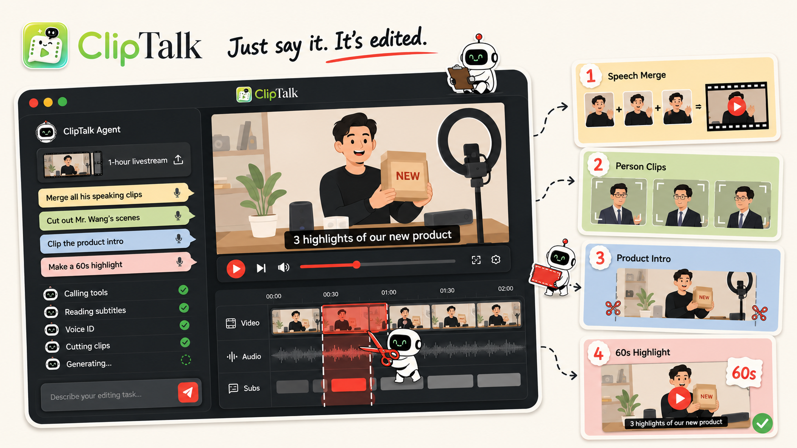
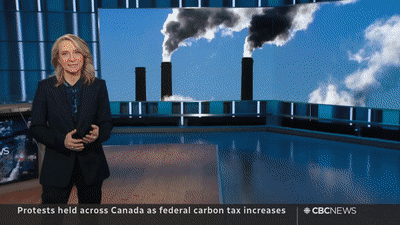
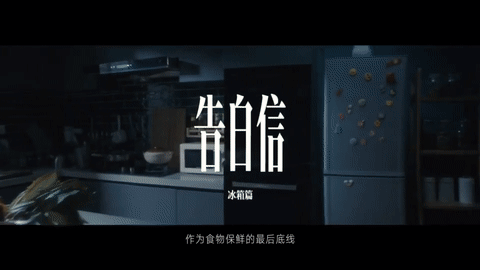
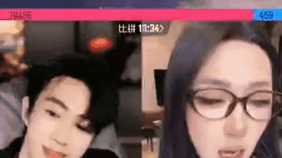
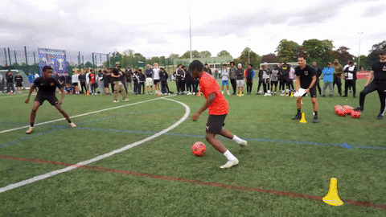
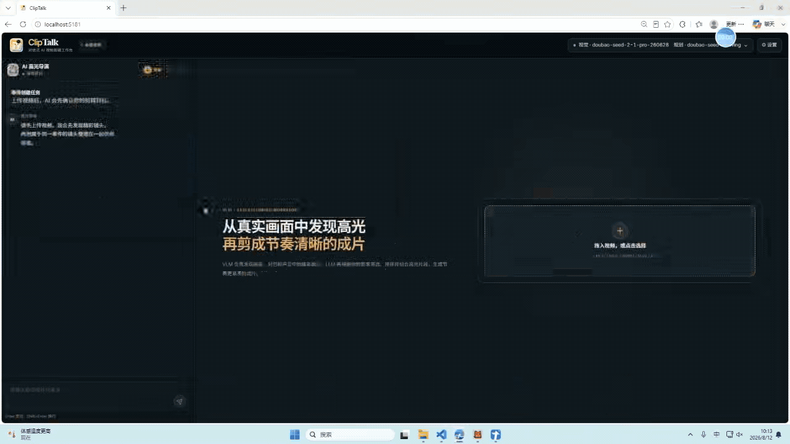

<div align="center">

<!-- 👇 在这里替换你的封面 Banner -->



# ClipTalk ✂️

### 一个通过对话完成视频剪辑的 AI Agent

**只需要说出来，视频就剪好了。**

[](./LICENSE)
[](https://github.com/GML-MMGroup/ClipTalk)
[](https://github.com/GML-MMGroup/ClipTalk/releases)
[](https://discord.gg/yourlink)

[English](./README.md) · **简体中文** · [在线体验](#) · [文档](#)

</div>

---

## 📰 最新动态

* **[2026-08-12]** 🚀 优化时间轴显示，并新增 **竖屏创作模式** 切换支持。
* **[2026-07-20]** ✨ 新增 **高光剪辑 Agent**，支持自动提取视频高光片段。
* **[2026-07-10]** 🎉 ClipTalk 正式 **开源**！

<!-- 后续更新持续追加到这里 -->

---

## 🗺️ Roadmap

ClipTalk 正在持续迭代，希望打造一个更强大的对话式视频剪辑体验。

* [x] 💬 **对话式剪辑基础设施**
* [x] ⚡ **高光剪辑 Agent**
* [ ] 👤 **人脸匹配剪辑** — 找到视频中的目标人物，并提取其出现在画面中的所有片段。
* [ ] 🔊 **声纹识别剪辑** — 通过声纹识别目标说话人，并提取该人物讲话的片段。
* [ ] 🧭 **话题分割剪辑** — 理解视频内容，并围绕指定话题自动提取相关片段。
* [ ] 🎞️ **可二次编辑时间轴** — 对 AI 自动生成的剪辑结果继续在时间轴中进行精细调整和二次编辑。

---

## 🌟 效果展示 — 一句话，完成一次剪辑

> 只需要一句自然语言指令，ClipTalk 即可完成真实的视频剪辑任务。
>
> <!-- 在这里添加 GIF 对比：原始素材 → 用户指令 → 剪辑结果 -->
<div align="center">
<table>
  <tr>
    <td align="center"><b>📰 新闻与资讯高光</b><br/></td>
    <td align="center"><b>🧵 DIY 与手工教程</b><br/></td>
    <td align="center"><b>📦 产品介绍</b><br/></td>
  </tr>
  <tr>
    <td align="center"><b>🏢 生活 Vlog</b><br/></td>
    <td align="center"><b>🔥 直播 PK 情绪高光</b><br/></td>
    <td align="center"><b>⚽ 体育赛事高光</b><br/></td>
  </tr>
</table>
</div>

---

## 💡 什么是 ClipTalk？

ClipTalk 是一个 **AI 视频剪辑 Agent**。

你不需要在时间轴上反复拖拽素材，也不需要在几个小时的视频中来回寻找片段。你只需要用自然语言描述自己想要什么，Agent 就可以自动完成整个剪辑流程：

**理解视频内容 → 定位目标内容 → 规划剪辑方案 → 执行剪辑 → 输出最终片段。**

<div align="center">
  
  <br />
  <sub><b>“把最精彩的部分剪成一个高光视频。”</b> — ClipTalk 会自动分析视频内容、展示事件时间轴，并生成多个 AI 剪辑版本。</sub>
</div>

<br />

> 上传一个 1 小时的视频，告诉 ClipTalk 你想要哪些内容，让它自动理解素材、规划剪辑并输出最终视频。

---

## ✨ 核心特性

### 💬 对话式剪辑

只需要描述你想要什么，就可以完成视频剪辑。

从：

*“把最精彩的部分剪成一个高光视频”*

到：

*“把介绍 XX 产品的部分剪出来”*

ClipTalk 可以直接把自然语言指令转换成具体的剪辑操作。

你还可以通过多轮对话继续调整结果，例如：

*“再短一点”*

或者：

*“从讲价格的地方开始。”*

### 🎯 四大核心剪辑能力

* **⚡ 高光切片提取** — 自动理解长视频内容，识别其中最有价值的时刻，并生成精炼的高光片段。

* **👤 人脸匹配剪辑** — 找到视频中的目标人物，并自动提取其出现在画面中的片段。

* **🧭 话题分割剪辑** — 根据指定话题定位并提取相关内容，例如 *“把讲解 XX 产品的片段剪出来。”*

* **🔊 声纹识别剪辑** — 通过声纹识别指定说话人，并自动提取该人物讲话的所有片段。

---

## 🏗️ 工作原理

ClipTalk 会把自然语言剪辑指令转换成完整的视频剪辑流程。

### 👤 人脸匹配剪辑

```text
💬 “把所有王总出现的画面剪出来”
        ↓
🤖 Agent 理解目标人物
        ↓
👤 人脸匹配 → 定位所有目标人物出现的画面
        ↓
✂️ 剪辑片段 → 🎞️ 合成 → ✅ 完成
```

### ⚡ 高光剪辑

```text
💬 “把最精彩的部分剪成一个高光视频”
        ↓
🤖 Agent 分析视频内容
        ↓
🎬 理解事件 → 识别高光时刻 → 选择关键片段
        ↓
✂️ 剪辑并排序 → 🎞️ 合成 → ✅ 完成
```

### 🧭 话题分割剪辑

```text
💬 “把讲解 XX 产品的片段剪出来”
        ↓
🤖 Agent 理解目标话题
        ↓
📝 分析对话 → 🧭 话题分割 → 定位相关内容
        ↓
✂️ 剪辑片段 → 🎞️ 合成 → ✅ 完成
```

**一句指令输入，最终视频输出。**

---

## 🚀 快速开始

需要 Linux x86_64（Windows 可使用 WSL2）、Python 3.10/3.11、FFmpeg 和 ffprobe。

```bash
git clone https://github.com/GML-MMGroup/ClipTalk.git
cd ClipTalk

python3 -m venv .venv
source .venv/bin/activate
python -m pip install --upgrade pip
python -m pip install -r requirements-audiovisual.txt
bash start.sh
```

### 模型职责

* **VLM · 必需** — 理解画面、发现事件并精修镜头边界。
* **LLM · 可选** — 规划镜头取舍、顺序和不同成片方向；可以直接复用 VLM。
* **SenseVoice · 可选/本地运行** — 补充带时间范围的对白、情绪和声音证据；不可用时仍可纯视觉分析。

打开终端输出的访问地址，在 **Settings** 中配置 VLM，并按需配置独立 LLM；然后上传视频并描述剪辑要求。

---

## ⚙️ 部署

### 🐳 Docker

```bash
git clone https://github.com/GML-MMGroup/ClipTalk.git
cd ClipTalk
cp .env.example .env
docker compose up --build
```

打开终端实际输出的访问地址，然后在 **Settings** 中配置视觉模型和剪辑规划模型。

### 🔧 可选配置

- **NVIDIA GPU：** 显卡驱动支持 CUDA 12.1 时，使用 `requirements-audiovisual-cu121.txt` 代替 CPU 依赖。
- **SenseVoice：** 可选的本地语音模型会在首次使用时自动下载；纯视觉分析不依赖它。
- **环境变量：** 查看 [`.env.example`](./.env.example)。请勿提交 `.env` 或 API Key。

<details>
<summary><strong>远程部署与安全</strong></summary>

远程访问时，原生部署设置 `HIGHLIGHT_HOST=0.0.0.0`，Docker 设置 `CLIPTALK_BIND_ADDRESS=0.0.0.0`。同时配置高强度的 `HIGHLIGHT_ACCESS_TOKEN`、开放实际使用的端口；若面向公网，请使用带身份验证的 HTTPS 反向代理。

</details>

---

## 🤝 参与贡献

<div align="center">

⭐ 如果 ClipTalk 对你有帮助，欢迎给项目点一个 Star！

Made with ❤️ by the ClipTalk Team

</div>
