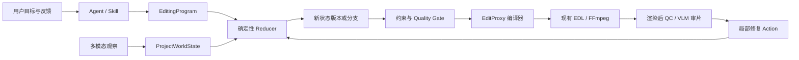

# ClipTalk 可执行编辑世界实施方案

状态：提案，可进入技术评审  
目标版本：`ProjectWorldState v1` / `EditingProgram v1` / `EditProxy v1`  
适用范围：现有高光、内容检索、人物剪辑、说话人剪辑和 Agent 工作流

## 1. 目标

把当前分散在 Job、EvidenceGraph、EditingIntent、EditSession、Agent Workspace 和输出版本中的状态，逐步收敛为一个可持久化、可重放、可分支、可验证的“编辑世界”。

目标不是重写现有媒体内核，也不是让 Agent 执行任意 Python。目标是让 Agent 只负责低频语义决策，由类型安全的编辑程序和确定性代码负责状态变化、约束校验、预览编译和 FFmpeg 渲染。

完成后应支持：

- 用户修改目标后只更新受影响的状态，不默认重新分析全片；
- 每个剪辑决定都能追溯到素材证据、用户约束和状态版本；
- 同一初始状态与同一编辑程序产生相同状态哈希和 EDL；
- 多个剪辑方向先在状态分支中模拟，通过预检后再选择性渲染；
- 用户确认和拒绝的内容成为持久事实，不在后续版本中被静默遗忘；
- 未来的人物跟踪式重构、直播增量剪辑和跨任务记忆有统一承载层。

## 2. 明确不做的事情

本方案第一轮不包含：

- 不把生成式视频模型接入默认渲染链路；
- 不允许 Agent 生成并直接执行任意 Python、Shell 或 FFmpeg 参数；
- 不改变正式导出、删除、身份确认等现有人工门禁；
- 不立即迁移或重写历史 Job；
- 不在首版引入外部图数据库或向量数据库；
- 不承诺跨视频真实人物身份识别。

## 3. 当前基础与主要问题

现有实现已经具备大部分构件：

- `app/agent_platform.py`：计划、Skill、工具、审批、事件和重规划；
- `app/evidence_graph.py`：候选、事件、关系、不确定性、来源和图哈希；
- `app/editing_intent.py`：用户硬约束、软目标与序列校验；
- `app/edit_sessions.py`：时间线状态、编辑操作、撤销和预检；
- `app/quality_gate.py`：渲染前规则和最终质量门；
- `app/composition_review.py`：联系表、动态审核代理和渲染后检查；
- `app/store.py` 与 `app/agent_store.py`：Job 和 Agent 状态持久化。

当前主要问题不是缺少能力，而是缺少统一事实源：

1. 同一概念在多个结构中拥有不同 ID、状态和生命周期。
2. EvidenceGraph 更接近分析快照，EditSession 更接近时间线快照，两者之间没有标准状态转移协议。
3. 用户反馈有时修改 brief，有时触发局部搜索，有时生成 proposal；拒绝信息没有统一负证据表示。
4. Agent 工具返回业务结果，但没有统一的前置条件、状态变更、后置条件与结果哈希。
5. 当前动态 review proxy 是压缩后的审核媒体，不是可规定裁切、主体、字幕和音频约束的控制层。

## 4. 目标架构



职责边界：

- Agent：解释目标、选择策略、生成或修改 EditingProgram；
- ProjectWorldState：保存当前项目中已知的事实、假设、约束、时间线和历史；
- Reducer：验证 Action 并确定性地产生下一状态；
- EditProxy：把状态编译为可检查、可寻址的渲染控制条件；
- 现有媒体内核：继续负责抽帧、裁剪、合成、代理和质检；
- Quality Gate：继续阻止不安全或不完整的结果进入展示和导出。

## 5. 核心数据契约

### 5.1 ProjectWorldState v1

首版保存轻量 JSON；帧、视频、embedding 和大型检测结果只保存引用，不写入状态正文。

```json
{
  "schemaVersion": 1,
  "projectId": "source_job_id",
  "revision": 12,
  "parentRevision": 11,
  "stateHash": "sha256...",
  "source": {
    "jobId": "job_id",
    "sourceHash": "sha256...",
    "duration": 1240.2
  },
  "entities": {
    "shots": {},
    "events": {},
    "speechUnits": {},
    "people": {},
    "speakers": {},
    "contentMatches": {},
    "clips": {},
    "subtitleCues": {},
    "outputs": {}
  },
  "relations": [],
  "beliefs": [],
  "intent": {},
  "timeline": {
    "clipIds": [],
    "subtitleDraftId": null,
    "markers": [],
    "textLayers": []
  },
  "feedback": {
    "acceptedEvidenceIds": [],
    "rejectedEvidenceIds": [],
    "corrections": []
  },
  "artifacts": {
    "evidenceGraphHash": "",
    "editProgramHash": "",
    "editProxyHash": "",
    "previewFingerprint": ""
  },
  "createdAt": "ISO-8601",
  "createdBy": "system|agent|user"
}
```

状态规则：

- `stateHash` 不包含 `createdAt` 等非语义字段；
- entity ID 在同一源项目中稳定，不能因重新排序而变化；
- 用户确认优先级高于模型推断，但不能覆盖源媒体事实；
- 推断必须携带 `confidence`、`provenance` 和 `verificationStatus`；
- 被否定的 belief 不删除，标记为 `rejected` 并记录替代事实；
- 每个 revision 不可原地修改；新变更产生新 revision；
- 派生 Job 共享 source entities，但拥有独立 intent、timeline 和 outputs。

### 5.2 StateAction v1

所有会改变编辑世界的动作统一使用以下信封：

```json
{
  "schemaVersion": 1,
  "actionId": "action_uuid",
  "idempotencyKey": "stable_key",
  "projectId": "source_job_id",
  "baseRevision": 11,
  "actor": "agent|user|system",
  "type": "timeline.trim_clip",
  "arguments": {},
  "evidenceRefs": [],
  "preconditions": [],
  "expectedPostconditions": [],
  "reason": "用户要求保留完整回答",
  "createdAt": "ISO-8601"
}
```

Reducer 输出：

```json
{
  "status": "applied|rejected|conflict|noop",
  "baseRevision": 11,
  "resultRevision": 12,
  "resultHash": "sha256...",
  "changedPaths": [],
  "violations": [],
  "invalidatedArtifacts": []
}
```

首版 Action 类型只覆盖已有能力：

- `intent.update`；
- `evidence.accept`、`evidence.reject`、`evidence.correct`；
- `timeline.insert_clip`、`timeline.delete_clips`、`timeline.trim_clip`；
- `timeline.split_clip`、`timeline.reorder_clips`、`timeline.update_clip`；
- `subtitle.set_draft`、`timeline.add_marker`；
- `proposal.apply`、`proposal.cancel`；
- `review.record_issue`、`review.resolve_issue`。

### 5.3 EditingProgram v1

EditingProgram 是声明式 JSON，不是脚本语言。Agent 只能生成白名单算子。

```json
{
  "schemaVersion": 1,
  "programId": "program_uuid",
  "baseRevision": 11,
  "goal": "60 秒人物反应高光，不要价格部分",
  "steps": [
    {"op": "select_evidence", "where": {"eventRole": ["reaction", "climax"]}},
    {"op": "exclude_content", "query": "价格"},
    {"op": "preserve_boundaries", "kinds": ["speech", "action"]},
    {"op": "sequence", "strategy": "narrative_dependencies"},
    {"op": "fit_duration", "targetSeconds": 60, "toleranceSeconds": 6},
    {"op": "validate", "policy": "composition-quality-v8"}
  ]
}
```

首版算子必须编译到现有函数，禁止增加第二套剪辑算法：

- `select_evidence` → EvidenceGraph / content matches；
- `exclude_content` → EditingIntent exclusions；
- `preserve_boundaries` → 现有 speech/action boundary 校验；
- `sequence` → 现有事件关系与编排逻辑；
- `fit_duration` → 现有时长预算和 optimizer；
- `validate` → `evaluate_sequence_against_intent` 与 Quality Gate；
- 最终变更 → 现有 EditSession proposal operations。

### 5.4 EditProxy v1

注意：EditProxy 与现有“动态审核代理视频”是两种不同产物。前者是渲染控制合同，后者是审核媒体。

```json
{
  "schemaVersion": 1,
  "proxyId": "proxy_uuid",
  "worldStateHash": "sha256...",
  "canvas": {"width": 1080, "height": 1920, "fps": 25},
  "segments": [
    {
      "clipId": "clip_id",
      "source": {"assetId": "asset_id", "start": 10.2, "end": 17.8},
      "output": {"start": 0.0, "end": 7.6},
      "cropTrack": [],
      "requiredVisibleEntityIds": [],
      "subtitleSafeArea": {},
      "audioEnvelope": [],
      "transitionIn": {"type": "cut", "duration": 0}
    }
  ]
}
```

v1 只需要精确表达现有 EDL、字幕和音频参数。动态主体轨迹放在后续版本，不阻塞统一合同落地。

## 6. 持久化方案

编辑世界属于 Python 媒体内核，不写入 Node Agent SQLite。新增独立的 `data/project-state.sqlite3`，避免扩大当前 Job JSON 的写放大和锁竞争。

建议表结构：

```sql
CREATE TABLE project_state_snapshots (
  project_id TEXT NOT NULL,
  revision INTEGER NOT NULL,
  state_hash TEXT NOT NULL,
  payload TEXT NOT NULL,
  created_at TEXT NOT NULL,
  PRIMARY KEY(project_id, revision)
);

CREATE TABLE project_state_actions (
  project_id TEXT NOT NULL,
  sequence INTEGER PRIMARY KEY AUTOINCREMENT,
  action_id TEXT NOT NULL UNIQUE,
  idempotency_key TEXT NOT NULL UNIQUE,
  base_revision INTEGER NOT NULL,
  result_revision INTEGER,
  action_type TEXT NOT NULL,
  payload TEXT NOT NULL,
  status TEXT NOT NULL,
  result_hash TEXT,
  created_at TEXT NOT NULL
);
```

策略：

- 第一阶段只做影子投影，不作为线上事实源；
- 第二阶段对受支持的操作进行 Job + WorldState 双写；
- 双写顺序为“先验证 Action，保存 Job，保存 WorldState，再发布事件”；
- 任一步失败时保留可恢复记录，不把部分状态暴露为最新 revision；
- 每 20 个 Action 或状态正文超过阈值时写完整 snapshot；
- 中间 revision 可由最近 snapshot 加 Action 重放；
- 正式切换前，Job 仍是兼容 API 的读取来源；
- 只有在重放、双写一致性和回滚演练通过后，WorldState 才能成为新功能的事实源。

## 7. 代码改造清单

### 新增模块

- `app/project_state_schema.py`：schema 常量、规范化、语义哈希；
- `app/project_state_store.py`：SQLite snapshot/action store；
- `app/project_world_state.py`：从 Job 构建投影、Reducer、diff、replay；
- `app/edit_program.py`：EditingProgram 校验、算子注册与编译；
- `app/edit_proxy.py`：EditProxy 构建、哈希和现有 EDL 适配；
- `app/project_state_api.py`：只读状态、diff、分支和诊断 API；
- `tests/test_project_world_state.py`；
- `tests/test_project_state_store.py`；
- `tests/test_edit_program.py`；
- `tests/test_edit_proxy.py`；
- `tests/fixtures/project-world-state/`：脱敏 golden fixtures。

### 修改模块

- `app/main.py`：装配 store、feature flag、双写入口；
- `app/evidence_graph.py`：提供稳定 entity projection，不改变现有图输出；
- `app/edit_sessions.py`：把现有 proposal operations 映射为 StateAction；
- `app/editing_intent.py`：提供 intent projection 与 `intent.update` reducer；
- `app/agent_platform.py`：在工具结果中记录 program/action refs；
- `app/quality_gate.py`：接受 world state / proxy refs，保持旧调用兼容；
- `app/api_schemas.py`：增加只读 API 响应模型；
- `app/config.py`：增加功能开关；
- `app/system_status.py`：暴露低基数迁移与一致性指标；
- `tools/check_repository.py`：加入 schema、fixture 和迁移检查。

## 8. API 草案

首轮 API 仅用于诊断与前端实验，不替换现有 Job API。

```text
GET  /api/projects/{projectId}/world-state
GET  /api/projects/{projectId}/world-state/revisions
GET  /api/projects/{projectId}/world-state/diff?from=11&to=12
GET  /api/projects/{projectId}/world-state/actions
POST /api/projects/{projectId}/world-state/replay-check
POST /api/projects/{projectId}/edit-programs/validate
POST /api/projects/{projectId}/edit-programs/simulate
GET  /api/projects/{projectId}/edit-proxy/{proxyId}
```

要求：

- 默认响应使用 public projection，不暴露绝对文件路径、模型密钥或内部 prompt；
- 所有修改 API 必须带 `baseRevision` 与 idempotency key；
- revision 冲突返回 HTTP 409，不做最后写入者覆盖；
- simulate 不修改正式状态，不触发媒体渲染；
- 大型实体集合支持摘要和分页，避免把全片图直接塞给浏览器或 Agent。

## 9. 分阶段实施

人日为单名熟悉当前代码的开发者估算，不含真实视频标注和外部模型等待时间。

### 阶段 0：契约和影子投影，3–5 人日

任务：

1. 定义三个 v1 schema 和语义哈希规则。
2. 实现 `project_world_state_from_job(job)`，只读投影现有 Job。
3. 为四类工作流各准备至少两个脱敏 fixture。
4. 加入只读诊断 API 和 `PROJECT_WORLD_STATE_MODE=off|shadow`。
5. 记录构建耗时、状态大小和投影失败原因。

验收：

- 不改变现有 API、队列、渲染和前端行为；
- 相同 Job 连续投影 100 次得到相同 state hash；
- 四类工作流 fixture 均可投影；
- 缺少 EvidenceGraph、EditSession 或输出的历史 Job 仍能生成部分状态；
- 单个常规 Job 投影 P95 小于 200 ms，状态正文不嵌入大型数组或媒体。

回滚：关闭 feature flag，不产生持久数据。

### 阶段 1：Action、Reducer 与重放，5–8 人日

任务：

1. 实现独立 SQLite store、Action 幂等和 revision 冲突。
2. 实现 intent、evidence、timeline、subtitle 的首批 reducer。
3. 将现有 proposal apply/cancel 和用户反馈影子转换为 Action。
4. 写入 snapshot/action，但现有 Job 继续作为事实源。
5. 加入 replay checker 和 Job ↔ WorldState 一致性报告。

验收：

- Action 重复提交不会产生第二个 revision；
- 使用 snapshot + actions 重放得到相同 result hash；
- 故意使用旧 baseRevision 必须返回 conflict；
- 现有撤销、proposal stale 检测和人工门禁不退化；
- 真实场景验证中 Job 与 WorldState 关键字段一致率为 100%。

回滚：切回 `shadow`；独立 SQLite 可保留诊断，也可停用，不影响 Job。

### 阶段 2：EditingProgram 编译，6–10 人日

任务：

1. 实现白名单算子、JSON Schema 和静态验证。
2. 编译到现有 EvidenceGraph、EditingIntent、optimizer 和 proposal operations。
3. Agent 的 `propose_timeline_edit` 保存 program 与 program hash。
4. 增加 `simulate`：返回预期 diff、约束报告和估计时长，不渲染媒体。
5. 不支持的操作明确失败或回落到原 planner，不能静默忽略。

验收：

- 现有 Agent 场景测试全部通过；
- 相同 state + program 得到相同 proposal operations；
- 所有自动应用的 timeline 变更都能追溯到 program/action；
- 任意未知算子、额外参数和越权副作用在执行前被拒绝；
- 不允许 program 绕过身份、正式导出和删除确认。

回滚：Agent 继续使用现有 proposal 生成路径；已保存 program 仅作审计信息。

### 阶段 3：EditProxy v1 与分支模拟，6–9 人日

任务：

1. 从 WorldState / EditSession 生成 EditProxy JSON。
2. 从 EditProxy 反向生成现有 composition segments，进行等价性检查。
3. 支持从共同 baseRevision 建立多个内存分支。
4. 每个分支先运行 intent validation、edit preflight 和 Quality Gate 静态部分。
5. UI 先展示版本 diff：镜头增删、时长、约束覆盖和预计问题。

验收：

- EditProxy 编译出的 segment 顺序、源范围、时长、转场、音频参数与现有 EDL 一致；
- 分支模拟不修改正式 project revision；
- 任一分支失败不会污染其他分支；
- 同一 proxy hash 复用缓存；
- 用户能在渲染前看到版本间的结构化差异。

回滚：关闭 proxy/branch flag，仍由现有 EditSession 直接渲染。

### 阶段 4：质量闭环与选择性渲染，5–8 人日

任务：

1. 将渲染后 QC/VLM 问题映射为 `review.record_issue` Action。
2. 建立有限的 root-cause → 修复算子表，优先局部边界和转场修复。
3. 自动版本先模拟评分，只渲染满足门槛的前 N 个分支。
4. 对修复前后保存 state diff、issue 状态和复审结果。
5. 保留最大修复轮数和成本上限，超过后进入人工审核。

验收：

- 局部可修问题不会触发默认全片重分析；
- 关键问题未解决时仍不能进入推荐或正式导出；
- 自动修复循环有最大轮数、幂等键和取消能力；
- 现有质量门分数和问题不会因重复汇总而膨胀；
- 相较基线，单个被接受版本的无效渲染数量下降至少 25%。

回滚：关闭 selective render，恢复当前全部请求版本的渲染策略。

### 阶段 5：动态重构与增量项目，后续独立立项

候选工作：

- `cropTrack` 与人物/物体轨迹驱动的横竖屏重构；
- 字幕和主体安全区冲突检测；
- 长视频/直播只对新增时间范围追加 entity 和 observation；
- 项目内用户偏好和负证据复用；
- 跨视频匿名人物或声纹能力接入统一 belief/identity 模型。

这些能力只能建立在阶段 0–4 的状态与重放稳定后，不应提前耦合进 v1 schema。

## 10. 建议 PR 切分

为降低评审和回滚风险，建议按以下顺序提交：

1. `PR-1 schema-and-hash`：schema、规范化、语义哈希、fixtures；
2. `PR-2 shadow-projection`：Job → WorldState 与诊断 API；
3. `PR-3 state-store`：SQLite、snapshot、action、replay；
4. `PR-4 reducers-intent-evidence`：意图与证据 reducer；
5. `PR-5 reducers-timeline`：EditSession operation 适配；
6. `PR-6 editing-program`：算子、validator、compiler、simulate；
7. `PR-7 agent-program-link`：Agent plan/tool result 绑定 program/action refs；
8. `PR-8 edit-proxy`：proxy 编译和 EDL 等价测试；
9. `PR-9 branch-diff-ui`：多分支模拟与结构化 diff；
10. `PR-10 quality-loop`：问题 Action、局部修复和选择性渲染。

每个 PR 必须能单独关闭，不允许 PR-1 到 PR-5 同时形成不可回滚的大迁移。

## 11. 测试计划

### 单元测试

- schema normalization 和未知字段处理；
- 语义哈希忽略非语义字段；
- 每个 Action 的成功、noop、conflict、rejected；
- Action 幂等；
- snapshot + replay 哈希一致；
- program 未知算子、非法参数和副作用拒绝；
- proxy 与 EDL 时长和时间码等价；
- belief 的确认、否定和替代关系。

### 集成测试

- 四类工作流从真实 Job 投影到 WorldState；
- Agent plan → EditingProgram → proposal → apply → preview；
- 用户反馈 → Action → 新 revision → 局部重算；
- 多分支模拟互不污染；
- 服务重启后重放和未完成 Action 恢复；
- 旧 Job 在 feature flag 开启时仍可读、可编辑、可渲染。

### 回归命令

```bash
python3 -m pytest -q
npm run test:frontend
npm run benchmark:quality
python3 tools/validate_agent_scenarios.py --help
python3 tools/validate_workflows.py --help
```

### 必须增加的故障注入

- 保存 Job 后、保存 WorldState 前进程退出；
- Action 重试两次；
- 同一 baseRevision 并发修改；
- state snapshot 损坏但 action log 完整；
- program 编译成功但 proposal apply 前 workspace 已变化；
- proxy 已缓存但源 hash 或 state hash 变化。

## 12. 可观测性与成功指标

只记录低基数指标，不记录用户文本、文件名或媒体内容。

建议指标：

- `project_state_projection_total{status}`；
- `project_state_projection_seconds`；
- `project_state_replay_total{status}`；
- `project_state_consistency_total{status}`；
- `project_state_action_total{type,status}`，Action type 必须来自固定枚举；
- `edit_program_compile_total{status}`；
- `edit_program_simulation_seconds`；
- `edit_proxy_compile_total{status}`；
- `edit_branch_total{status}`；
- `local_revision_ratio`：局部修改占所有返修的比例；
- `full_reanalysis_after_feedback_ratio`；
- `renders_per_accepted_output`；
- `rejected_evidence_recurrence_ratio`；
- `state_replay_hash_mismatch_total`。

阶段 4 完成后的产品目标：

- 重放哈希一致率 100%；
- WorldState 与 Job 关键字段双写一致率 100%；
- 用户已拒绝证据再次自动入选率低于 1%；
- 普通返修中局部修改比例不低于 70%；
- 每个被接受成片对应的无效渲染数相较基线下降至少 25%；
- 所有正式成片都能追溯到 source hash、state revision、program hash 和 proxy hash。

## 13. 功能开关与上线策略

建议配置：

```dotenv
PROJECT_WORLD_STATE_MODE=off
EDITING_PROGRAM_MODE=off
EDIT_PROXY_MODE=off
EDIT_BRANCH_SIMULATION=0
SELECTIVE_RENDERING=0
```

环境推进顺序：

```text
off → shadow → internal → opt_in → default
```

- `shadow`：构建和比较，不影响结果；
- `internal`：仅开发/测试账号可查看诊断状态；
- `opt_in`：新任务可选择启用，旧任务继续旧路径；
- `default`：新任务默认启用，保留单次请求级回退；
- 旧任务永不因服务升级被静默迁移到新算法。

## 14. 主要风险与控制措施

### 状态结构过大

控制：只保存实体摘要与 artifact refs；大数组继续存在原缓存文件；public projection 分页。

### 双写不一致

控制：影子期一致性报告、Action 幂等、revision/hash、故障注入和可重放日志；正式切换前 Job 仍是事实源。

### Agent 生成不可执行计划

控制：白名单算子、严格 JSON Schema、静态验证、simulate、前后置条件和原 planner 回退。

### 新旧 ID 不稳定

控制：使用 source hash + 稳定语义键生成 entity ID；禁止使用列表位置作为永久身份。

### 规则过度收紧导致无结果

控制：区分 hard constraint、soft goal 和 review warning；失败应解释缺少什么，不能自动放宽用户硬约束。

### 迁移拖慢现有开发

控制：每阶段提供独立产物；先做适配层，不要求业务模块一次性改用 WorldState。

## 15. Definition of Done

本方案完成不是指“新增了几个数据类”，而是必须同时满足：

1. 四类现有工作流都能产生可重放 WorldState；
2. Agent 自动时间线修改均带 EditingProgram 和 StateAction；
3. 状态、程序、Proxy 和最终输出之间存在完整哈希链；
4. 多分支能在不渲染的情况下比较结构差异和硬约束；
5. 渲染后问题能回写为可追踪 issue，并至少支持局部边界与转场修复；
6. 旧 Job、现有 API、现有导出门禁和现有 Quality Gate 保持兼容；
7. 所有功能都可通过开关回退到当前路径；
8. 重放、一致性、故障恢复和真实工作流回归均通过。

## 16. 首个开发迭代建议

首个迭代只执行阶段 0，不同时启动 EditingProgram 或 UI 重构：

1. 建立 `project_state_schema.py`；
2. 从现有 Job 投影 `ProjectWorldState v1`；
3. 生成稳定 state hash；
4. 准备四类 workflow fixtures；
5. 加入 shadow API 和低基数指标；
6. 输出一份真实 Job 投影报告：缺失字段、状态大小、耗时和 ID 稳定性。

只有阶段 0 验收通过，才进入 Action/Reducer。这样可以先验证“统一状态是否真的能覆盖当前复杂度”，避免过早改造执行链。

## 17. 视频能力包增补

本方案后续新增两个独立能力包，它们都应通过 `StateAction`、artifact refs 和哈希链接入，而不是把大对象直接塞进 WorldState：

1. `cliptalk-cover-director`：已完成本地源帧版 v1。读取已确认成片与 evidence refs，产生候选帧、评分、三种封面预览和审批版本。封面 artifact 记录源时间、证据、构图参数、哈希与生成来源。
2. `cliptalk-smart-reframe`：读取已确认成片、人物/对象/说话人证据与镜头边界，产生逐镜头 crop track、重构图预览和质量报告。WorldState 只保存 track ref、hash、审批状态与问题摘要。

两项能力的调研和工具契约见：

- `docs/video-editing-skill-research.md`
- `docs/skill-proposals/cliptalk-cover-director/`
- `docs/skill-proposals/cliptalk-smart-reframe/`

`cliptalk-cover-director` 已进入 `CORE_TOOL_CATALOG`、执行器、managed profile、审核 UI 和测试，并作为内置 Skill 启用。`cliptalk-smart-reframe` 在相同接入条件完成前仍不得复制到自动启用的 `skills/` 目录。
